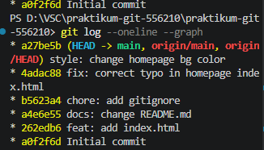

# Praktikum Git

This repository is used for practical learning about Git and GitHub.

## Folder Structure

- `index.html` - main page entry point
- `components/` - reusable HTML fragments
- `assets/images/` - image assets 
